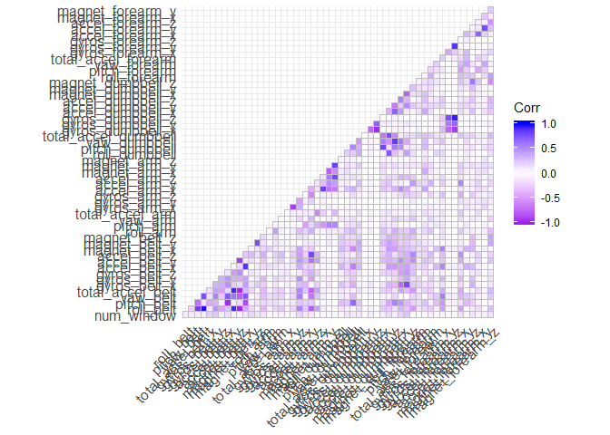
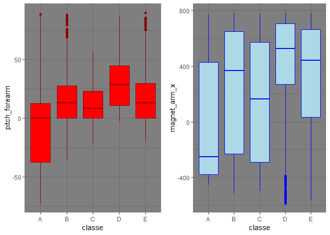
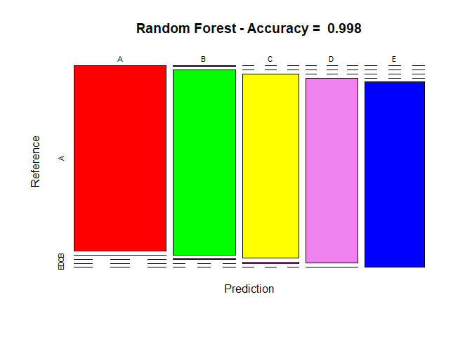

### Background

Using devices such as Jawbone Up, Nike FuelBand, and Fitbit it is now possible to collect a large amount of data about personal activity relatively inexpensively. These type of devices are part of the quantified self movement – a group of enthusiasts who take measurements about themselves regularly to improve their health, to find patterns in their behavior, or because they are tech geeks. One thing that people regularly do is quantify how much of a particular activity they do, but they rarely quantify how well they do it. In this project, your goal will be to use data from accelerometers on the belt, forearm, arm, and dumbell of 6 participants. They were asked to perform barbell lifts correctly and incorrectly in 5 different ways. More information is available from the website here: http://groupware.les.inf.puc-rio.br/har (see the section on the Weight Lifting Exercise Dataset).

### Executive summary

Based on a dataset provide by HAR http://groupware.les.inf.puc-rio.br/har we will try to train a predictive model to perdict what exercise was performed using a dataset with 159 features.

We'll take the following steps:

* Process the data, for use to this project
* Explore the data, especially focussing on the two parameters we are interested in
* Model selection, where we try different models to help us answere our questions
* Model examination, to see wether our best model holds up to our standards
* Conclusion where we answere the questions based on the data
* Predicting the classification of the model on test set.

### Libraries


```r
library(lattice)
library(ggplot2)
library(plyr)
library(randomForest)
library(caret)
library(rpart)
library(rpart.plot)
library(rattle)
library(corrplot)
library(RColorBrewer)
```

### Environment Preparation

First prepare the environment:

```r
## work dir
path <- getwd()
```

### Dataset Overview

The training data for this project are available here: https://d396qusza40orc.cloudfront.net/predmachlearn/pml-training.csv 

The test data are available here: https://d396qusza40orc.cloudfront.net/predmachlearn/pml-testing.csv

The data for this project come frome http://web.archive.org/web/20161224072740/http:/groupware.les.inf.puc-rio.br/har. 

My special thanks to the mentioned authors for being so generous in allowing their data to be used for this kind of assignment.

### Loading Data

The next step is loading the dataset from the URL provided above.


```r
## url training data file
url_train <- "https://d396qusza40orc.cloudfront.net/predmachlearn/pml-training.csv"

file_train <- "pml-training.csv"

if(!file.exists(file_train)){
	print("train_file_downloaded")
	download.file(url_train, file_train, method = "curl")
}

## url test data file
url_test <- "https://d396qusza40orc.cloudfront.net/predmachlearn/pml-testing.csv"

file_test <- "pml-testing.csv"

if(!file.exists(file_test)){
	print("test_file_downloaded")
	download.file(url_test, file_test, method = "curl")
}
```

### Preprocessing

### Reading data and evaluating their structure


```r
## processing
training <- read.csv("pml-training.csv")
testing <-read.csv("pml-testing.csv")

## exploratory data analyses
dim(training)  
```

```
## [1] 19622   160
```

```r
dim(testing) 
```

```
## [1]  20 160
```

```r
#head(training) #if necessary

#str(training) #if necessary

#summary(training) #if necessary
```

### Creating Partition


```r
## create a partition with the training dataset
in_train <- createDataPartition(training$classe, p = 0.75, list = FALSE)
train_set <- training[in_train, ]
test_set <- training[-in_train, ]
#dim(train_set) #if necessary

#dim(test_set) #if necessary
```

### Cleaning and Data Preparation


```r
## remove variables with NA variance
nvz <- nearZeroVar(train_set)
train_set <- train_set[, -nvz]
test_set <- test_set[, -nvz]


## remove variables mostly NA
all_na <- sapply(train_set, function(x) mean(is.na(x))) > 0.95
train_set <- train_set[, all_na==FALSE]
test_set <- test_set[, all_na==FALSE]

## remove identification only variables
train_set <- train_set[, -(1:5)]
test_set <- test_set[, -(1:5)]
dim(train_set)
```

```
## [1] 14718    54
```

```r
dim(test_set)
```

```
## [1] 4904   54
```

### Exploratory Data Analyses

Determine which variables are highly correlated with the class variable.


```r
## correlation analysis
library(ggcorrplot)
cor_matrix <- cor(train_set[, -54])
ggcorrplot(cor_matrix, type = "lower",
	colors = c("purple", "white", "blue"))
```

<div class="figure" style="text-align: center">

<p class="caption">Figure 1. Correlation matrix</p>
</div>

Even the best correlations with classe are hardly above 0.3. Let's check visually if there is indeed hard to use these 2 as possible simple linear predictors.


```r
library(Rmisc)
library(ggplot2)
library(RColorBrewer)

g1 <- ggplot(train_set, aes(classe, pitch_forearm)) +
	geom_boxplot(aes(fill = classe), col = "darkred", fill = "red") +
	scale_fill_brewer(palette="RColorBrewer") +
 	theme_dark()

g2 <- ggplot(train_set, aes(classe, magnet_arm_x)) +
	geom_boxplot(aes(fill = classe), col = "blue", fill = "lightblue") +
	scale_fill_brewer(palette="Blues") +
	theme_dark()

multiplot(g1, g2, cols = 2)
```

<div class="figure" style="text-align: center">

<p class="caption">Figure 2. The best correlations with classe</p>
</div>

### Prediction Models Building

Tree methods will be applied to model the regressions (in the train dataset) and the best one (with higher accuracy when applied to the test dataset) will be used for the quiz predictions. The methods are: Random Forests (randomForest), Decision Tree (rpart) and Support Machine Vector (svm).

#### Random Forest


```r
## method random forest
set.seed(1)
controlRF <- trainControl(method = "cv", number = 3, verboseIter = FALSE)
modFitRandForest <- train(classe ~ ., data = train_set, method = "rf",
	trControl = controlRF)
modFitRandForest$finalModel
```

```
## 
## Call:
##  randomForest(x = x, y = y, mtry = param$mtry) 
##                Type of random forest: classification
##                      Number of trees: 500
## No. of variables tried at each split: 27
## 
##         OOB estimate of  error rate: 0.24%
## Confusion matrix:
##      A    B    C    D    E  class.error
## A 4184    0    0    0    1 0.0002389486
## B    9 2835    3    1    0 0.0045646067
## C    0    6 2561    0    0 0.0023373588
## D    0    0    9 2402    1 0.0041459370
## E    0    0    0    6 2700 0.0022172949
```

```r
## prediction on test data
predictRandForest <- predict(modFitRandForest, newdata = test_set)
confMatRandForest <- confusionMatrix(predictRandForest, test_set$classe)
confMatRandForest
```

```
## Confusion Matrix and Statistics
## 
##           Reference
## Prediction    A    B    C    D    E
##          A 1394    1    0    0    0
##          B    1  948    2    0    0
##          C    0    0  853    5    0
##          D    0    0    0  799    1
##          E    0    0    0    0  900
## 
## Overall Statistics
##                                          
##                Accuracy : 0.998          
##                  95% CI : (0.9963, 0.999)
##     No Information Rate : 0.2845         
##     P-Value [Acc > NIR] : < 2.2e-16      
##                                          
##                   Kappa : 0.9974         
##  Mcnemar's Test P-Value : NA             
## 
## Statistics by Class:
## 
##                      Class: A Class: B Class: C Class: D Class: E
## Sensitivity            0.9993   0.9989   0.9977   0.9938   0.9989
## Specificity            0.9997   0.9992   0.9988   0.9998   1.0000
## Pos Pred Value         0.9993   0.9968   0.9942   0.9988   1.0000
## Neg Pred Value         0.9997   0.9997   0.9995   0.9988   0.9998
## Prevalence             0.2845   0.1935   0.1743   0.1639   0.1837
## Detection Rate         0.2843   0.1933   0.1739   0.1629   0.1835
## Detection Prevalence   0.2845   0.1939   0.1750   0.1631   0.1835
## Balanced Accuracy      0.9995   0.9991   0.9982   0.9968   0.9994
```

```r
## plot matrix results
plot(confMatRandForest$table, col = confMatRandForest$byClass,
	color = c("red", "green", "yellow", "violet", "blue"),
	main = paste("Random Forest - Accuracy = ",
		round(confMatRandForest$overall['Accuracy'], 4)))
```

<div class="figure" style="text-align: center">

<p class="caption">Figure 3. Random Forest</p>
</div>

The accuracy result is 99%, enough to get the prediction of the 20 values.

#### Decision Trees


```r
## method decision trees
set.seed(1)
mod_fit_dec_tree <- train(classe ~., data = train_set, method = "rpart")
fancyRpartPlot(mod_fit_dec_tree$finalModel)
```

<div class="figure" style="text-align: center">

<p class="caption">Figure 4. Decision Trees</p>
</div>

```r
pv <- predict(mod_fit_dec_tree, newdata = test_set)
cm_ct <- confusionMatrix(pv, test_set$classe)
cm_ct$cm_ct$overall['Accuracy']
```

```
## NULL
```

```r
cm_ct
```

```
## Confusion Matrix and Statistics
## 
##           Reference
## Prediction    A    B    C    D    E
##          A 1260  372  401  355  127
##          B   22  309   22  155  109
##          C  111  268  432  294  250
##          D    0    0    0    0    0
##          E    2    0    0    0  415
## 
## Overall Statistics
##                                           
##                Accuracy : 0.4927          
##                  95% CI : (0.4786, 0.5068)
##     No Information Rate : 0.2845          
##     P-Value [Acc > NIR] : < 2.2e-16       
##                                           
##                   Kappa : 0.3377          
##  Mcnemar's Test P-Value : NA              
## 
## Statistics by Class:
## 
##                      Class: A Class: B Class: C Class: D Class: E
## Sensitivity            0.9032  0.32561  0.50526   0.0000  0.46060
## Specificity            0.6423  0.92212  0.77204   1.0000  0.99950
## Pos Pred Value         0.5010  0.50081  0.31882      NaN  0.99520
## Neg Pred Value         0.9435  0.85071  0.88081   0.8361  0.89169
## Prevalence             0.2845  0.19352  0.17435   0.1639  0.18373
## Detection Rate         0.2569  0.06301  0.08809   0.0000  0.08462
## Detection Prevalence   0.5128  0.12582  0.27631   0.0000  0.08503
## Balanced Accuracy      0.7728  0.62386  0.63865   0.5000  0.73005
```

#### Support Vector Machine


```r
## support vector machine

library(dplyr)
library(e1071)

mod_train_svm <- svm(classe ~., data = train_set)
mod_predict_svm <- predict(mod_train_svm, test_set)
cm_svm <- confusionMatrix(mod_predict_svm, test_set$classe)
cm_svm
```

```
## Confusion Matrix and Statistics
## 
##           Reference
## Prediction    A    B    C    D    E
##          A 1381   72    2    0    0
##          B    1  853   31    0    1
##          C   10   17  809   74    7
##          D    1    0   11  729   20
##          E    2    7    2    1  873
## 
## Overall Statistics
##                                           
##                Accuracy : 0.9472          
##                  95% CI : (0.9406, 0.9533)
##     No Information Rate : 0.2845          
##     P-Value [Acc > NIR] : < 2.2e-16       
##                                           
##                   Kappa : 0.9331          
##  Mcnemar's Test P-Value : NA              
## 
## Statistics by Class:
## 
##                      Class: A Class: B Class: C Class: D Class: E
## Sensitivity            0.9900   0.8988   0.9462   0.9067   0.9689
## Specificity            0.9789   0.9917   0.9733   0.9922   0.9970
## Pos Pred Value         0.9491   0.9628   0.8822   0.9580   0.9864
## Neg Pred Value         0.9959   0.9761   0.9885   0.9819   0.9930
## Prevalence             0.2845   0.1935   0.1743   0.1639   0.1837
## Detection Rate         0.2816   0.1739   0.1650   0.1487   0.1780
## Detection Prevalence   0.2967   0.1807   0.1870   0.1552   0.1805
## Balanced Accuracy      0.9844   0.9452   0.9598   0.9495   0.9830
```

```r
plot(cm_svm$table, col = cm_svm$byClass,
	color = c("red", "green", "yellow", "violet", "blue"),
	main = paste("Support Vector Machine - Accuracy = ",
		round(cm_svm$overall['Accuracy'], 4)))
```

<div class="figure" style="text-align: center">

<p class="caption">Figure 5. Support Vector Machine</p>
</div>

The accuracy result is 94 %.

### Applying the Selected Model to the Test Data

The best accuracy of the 3 regression modeling methods above is Random Forest - 99%.

In that case, the Random Forest model will be applied to predict the 20 quiz results (testing dataset) as shown below.


```r
predict_test <- predict(modFitRandForest, newdata = testing)
predict_test
```

```
##  [1] B A B A A E D B A A B C B A E E A B B B
## Levels: A B C D E
```
